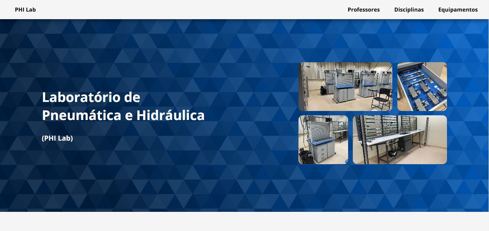

# Laboratório de Pneumática e Hidraulica (PHI Lab)

# Descrição do Projeto

O site do Laboratório de Pneumática e Hidráulica (PHI Lab) tem como objetivo apresentar as funcionalidades e a importância da instalação para o ensino de pneumática e hidráulica no Instituto Federal de São Paulo - Câmpus Itapetininga. Além de oferecer uma visão geral sobre os equipamentos e sistemas utilizados, o site também destaca as aplicações práticas do laboratório, promovendo o conhecimento e a valorização dessas áreas de estudo.

# Status do Projeto
Status: Em Desenvolvimento...

# Funcionalidades e Demonstração
O projeto exibe diversas informações sobre o Laboratorio de Pneumática e Hidráulica, com o objetivo de apresentar de forma clara e interativa os recursos e equipamentos disponíveis.

# Acesso ao Projeto (Link do Projeto)
[PHI Lab](https://philab.fabsoftware.itp.ifsp.edu.br)

# Contribuição/Autores
| [ Luma Karoline de Siqueira](https://github.com/maLu70)